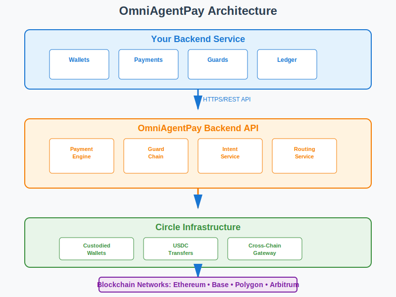

# OmniAgentPay Node.js SDK

> **Stripe-grade SDK for agent-initiated payments** - Enable AI systems to safely simulate, approve, and execute payments with enterprise guardrails.

[](https://www.npmjs.com/package/omniagentpay)
[](https://nodejs.org/)
[](LICENSE)

## 📋 Table of Contents

- [Quick Start](#-quick-start)
- [Architecture](#-architecture)
- [Core Concepts](#-core-concepts)
- [API Reference](#-api-reference)
- [Security](#-security)
- [Python SDK Parity](#-python-sdk-parity)
- [Support](#-support)

---

## 🚀 Quick Start

### Installation

```bash
npm install omniagentpay
```

**Requirements:**
- Node.js 18.0.0+
- OmniAgentPay API key ([Get one here](https://console.omniagentpay.xyz))

### Basic Usage

```typescript
import { OmniAgentPayClient } from 'omniagentpay';

// Initialize client
const client = new OmniAgentPayClient({
  apiKey: process.env.OMNIAGENTPAY_API_KEY,
  baseUrl: 'https://api.omniagentpay.xyz'
});

// Create wallet and make payment
const wallet = await client.createWallet({ name: 'my-agent-wallet' });
const balance = await client.getBalance({ walletId: wallet.id });

const result = await client.pay({
  walletId: wallet.id,
  recipient: '0x742d35Cc6634C0532925a3b844Bc9e7595f5e4a0',
  amount: '10.50'
});

console.log(`Payment: ${result.success ? 'Success' : 'Failed'}`);
```

### Complete Example

```typescript
import { OmniAgentPayClient } from 'omniagentpay';

async function main() {
  const client = new OmniAgentPayClient({
    apiKey: process.env.OMNIAGENTPAY_API_KEY!,
    baseUrl: 'https://api.omniagentpay.xyz'
  });

  // Create wallet
  const wallet = await client.createWallet();

  // Add budget guard
  await client.addBudgetGuard({
    walletId: wallet.id,
    dailyLimit: '100.00'
  });

  // Simulate before executing
  const sim = await client.simulate({
    walletId: wallet.id,
    recipient: '0x742d35Cc6634C0532925a3b844Bc9e7595f5e4a0',
    amount: '50.00'
  });

  if (!sim.wouldSucceed) {
    console.error(`Blocked: ${sim.reason}`);
    return;
  }

  // Execute payment
  const result = await client.pay({
    walletId: wallet.id,
    recipient: '0x742d35Cc6634C0532925a3b844Bc9e7595f5e4a0',
    amount: '50.00'
  });
  
  console.log(`Success: ${result.success}, TX: ${result.blockchainTx}`);
}

main().catch(console.error);
```

---

## 🏗️ Architecture



```
┌─────────────────────────────────────────────────────────────────┐
│                      Your Backend Service                        │
│  ┌───────────────────────────────────────────────────────────┐ │
│  │              OmniAgentPay Node.js SDK                      │ │
│  │  ┌──────────┐  ┌──────────┐  ┌──────────┐  ┌──────────┐ │ │
│  │  │ Wallets  │  │ Payments  │  │  Guards  │  │ Ledger   │ │ │
│  │  └──────────┘  └──────────┘  └──────────┘  └──────────┘ │ │
│  └───────────────────────┬─────────────────────────────────────┘ │
└───────────────────────────┼───────────────────────────────────────┘
                            │ HTTPS/REST API
┌───────────────────────────▼───────────────────────────────────────┐
│                  OmniAgentPay Backend API                          │
│  ┌──────────────────────────────────────────────────────────────┐ │
│  │  ┌──────────┐  ┌──────────┐  ┌──────────┐  ┌──────────┐   │ │
│  │  │ Payment  │  │  Guard   │  │  Intent  │  │ Routing  │   │ │
│  │  │ Engine   │  │  Chain   │  │ Service  │  │ Service  │   │ │
│  │  └──────────┘  └──────────┘  └──────────┘  └──────────┘   │ │
│  └───────────────────────┬───────────────────────────────────────┘ │
└───────────────────────────┼───────────────────────────────────────┘
                            │
┌───────────────────────────▼───────────────────────────────────────┐
│                    Circle Infrastructure                           │
│  ┌──────────────┐  ┌──────────────┐  ┌──────────────┐          │
│  │   Custodied  │  │   USDC       │  │  Cross-Chain  │          │
│  │   Wallets    │  │   Transfers  │  │  Gateway      │          │
│  └──────────────┘  └──────────────┘  └──────────────┘          │
└───────────────────────────────────────────────────────────────────┘
                            │
┌───────────────────────────▼───────────────────────────────────────┐
│                    Blockchain Networks                            │
│         Ethereum • Base • Polygon • Arbitrum • ...               │
└───────────────────────────────────────────────────────────────────┘
```

### Key Design Principles

- **🔒 Custodied Wallets**: Private keys never leave Circle's secure infrastructure
- **🛡️ Guard System**: Programmable policies enforce spending limits and restrictions
- **🔄 Intent-Based**: Authorize before executing for multi-agent coordination
- **🌐 Cross-Chain**: Automatic routing across supported networks
- **📊 Full Auditability**: Complete transaction ledger and history

---

## 💡 Core Concepts

### Payment Intents

**Payment Intents** follow an Authorize-Capture pattern:

1. **Create Intent** → `createPaymentIntent()` - Validates guards and routing
2. **Confirm Intent** → `confirmPaymentIntent()` - Executes on-chain

This enables multi-agent coordination, human review workflows, and scheduled payments.

### Simulation vs Execution

| Feature | `simulate()` | `pay()` |
|---------|-------------|---------|
| **Cost** | Free | Gas fees |
| **Funds** | No movement | Real transfer |
| **Purpose** | Check guards, validate | Execute transaction |
| **Returns** | Validation result | Blockchain TX hash |

**Always simulate before executing** to check guard policies safely.

### Guardrails

**Guards** are programmable policies that enforce spending controls:

| Guard Type | Purpose | Example |
|-----------|---------|---------|
| **Budget** | Daily/hourly/lifetime limits | `dailyLimit: '100.00'` |
| **Rate Limit** | Prevent transaction flooding | `maxPerHour: 20` |
| **Recipient** | Whitelist/blacklist addresses | `mode: 'whitelist'` |
| **Single Transaction** | Cap individual amounts | `maxAmount: '50.00'` |
| **Confirm** | Require approval above threshold | `threshold: '500.00'` |

Guards are checked atomically during simulation and execution.

### Custodied Wallets

- ✅ Private keys managed by Circle (never exposed)
- ✅ SDK never handles or stores keys
- ✅ All signing happens server-side
- ✅ API-only access

---

## 📚 API Reference

### Client Initialization

```typescript
const client = new OmniAgentPayClient({
  apiKey: string,        // Required: Your API key
  baseUrl?: string,      // Optional: Defaults to https://api.omniagentpay.xyz
  timeout?: number       // Optional: Request timeout in ms (default: 30000)
});
```

### Payment Methods

#### `pay(params)` - Execute Payment

```typescript
const result = await client.pay({
  walletId: string,
  recipient: string,
  amount: string,
  destinationChain?: string,
  purpose?: string,
  idempotencyKey?: string,
  waitForCompletion?: boolean
});
```

#### `simulate(params)` - Simulate Payment

```typescript
const result = await client.simulate({
  walletId: string,
  recipient: string,
  amount: string
});
```

### Payment Intents

```typescript
// Create intent
const intent = await client.createPaymentIntent({
  walletId: string,
  recipient: string,
  amount: string
});

// Confirm intent
const result = await client.confirmPaymentIntent({
  intentId: string
});

// Get intent
const intent = await client.getPaymentIntent({ intentId: string });

// Cancel intent
await client.cancelPaymentIntent({ intentId: string });
```

### Wallet Management

```typescript
// Create wallet
const wallet = await client.createWallet({
  name?: string,
  blockchain?: string,
  walletSetId?: string
});

// Get balance
const balance = await client.getBalance({ walletId: string });

// List wallets
const wallets = await client.listWallets({ walletSetId?: string });

// Get wallet details
const wallet = await client.getWallet({ walletId: string });
```

### Guard Management

```typescript
// Budget guard
await client.addBudgetGuard({
  walletId: string,
  dailyLimit?: string,
  hourlyLimit?: string,
  totalLimit?: string
});

// Rate limit guard
await client.addRateLimitGuard({
  walletId: string,
  maxPerMinute?: number,
  maxPerHour?: number,
  maxPerDay?: number
});

// Recipient guard
await client.addRecipientGuard({
  walletId: string,
  mode: 'whitelist' | 'blacklist',
  addresses?: string[],
  domains?: string[]
});

// Single transaction guard
await client.addSingleTxGuard({
  walletId: string,
  maxAmount: string,
  minAmount?: string
});

// Confirm guard
await client.addConfirmGuard({
  walletId: string,
  threshold?: string,
  alwaysConfirm?: boolean
});

// List guards
const guards = await client.listGuards({ walletId: string });
```

### Transactions & Ledger

```typescript
// List transactions
const transactions = await client.listTransactions({
  walletId?: string,
  blockchain?: string
});

// Explain transaction
const explanation = await client.explainTransaction({
  txId: string
});
```

### Networks

```typescript
// List supported networks
const networks = await client.listNetworks();
```

> **📖 Full API Documentation**: See [docs.omniagentpay.xyz](https://docs.omniagentpay.xyz) for complete reference.

---

## 🔒 Security

### Backend-Only Execution

⚠️ **This SDK is for backend/server-side use only.**

- ❌ Never bundle in frontend applications
- ❌ Never expose to browser environments
- ✅ Gate behind your authentication/authorization
- ✅ Use environment variables for API keys

### No Private Keys

- Private keys never leave Circle's custody
- SDK never handles or stores keys
- All signing operations happen server-side

### Error Handling

```typescript
import { GuardError, NetworkError, OmniAgentPayError } from 'omniagentpay';

try {
  const result = await client.pay({ /* ... */ });
} catch (error) {
  if (error instanceof GuardError) {
    console.error(`Blocked by ${error.guardName}: ${error.reason}`);
  } else if (error instanceof NetworkError) {
    console.error(`API error: ${error.message}`);
  }
}
```

### Best Practices

- ✅ Store API keys in environment variables
- ✅ Use different keys for dev/production
- ✅ Rotate keys regularly
- ✅ Never commit keys to version control
- ✅ Enable audit logging

---

## 🐍 Python SDK Parity

This Node.js SDK matches the Python SDK (`omniagentpy`) API contract:

| Python SDK | Node.js SDK |
|-----------|-------------|
| `pay(wallet_id, recipient, amount)` | `pay({ walletId, recipient, amount })` |
| `create_payment_intent(...)` | `createPaymentIntent({ ... })` |
| `add_budget_guard(...)` | `addBudgetGuard({ ... })` |
| `list_wallets()` | `listWallets()` |

**Same behavior, same data structures, different syntax.**

---

## 📞 Support

- **Documentation**: [docs.omniagentpay.xyz](https://docs.omniagentpay.xyz)
- **GitHub**: [github.com/omniagentpay/omniagentpay-node](https://github.com/omniagentpay/omniagentpay-node)
- **Support Email**: [support@omniagentpay.xyz](mailto:support@omniagentpay.xyz)
- **Console**: [console.omniagentpay.xyz](https://console.omniagentpay.xyz)

---

## 📄 License

MIT License - see [LICENSE](LICENSE) file for details.

---

**Made with ❤️ for the AI agent economy**
